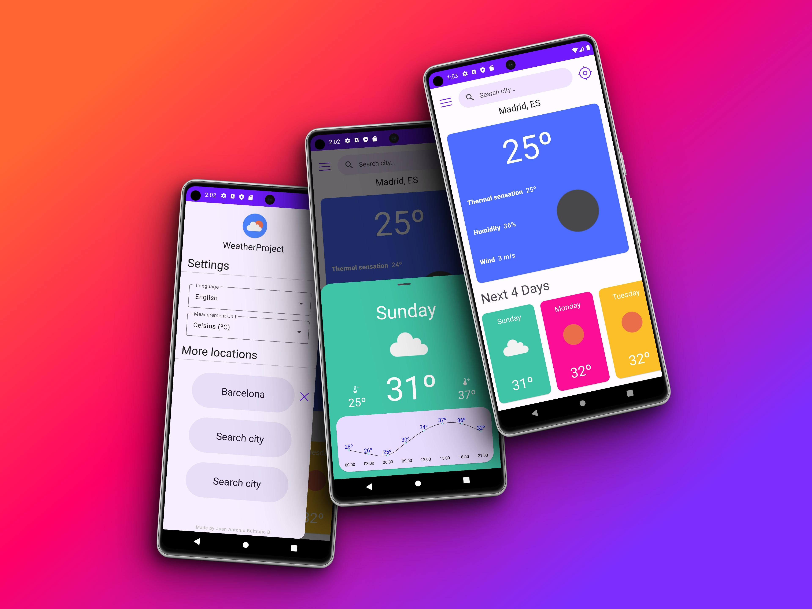
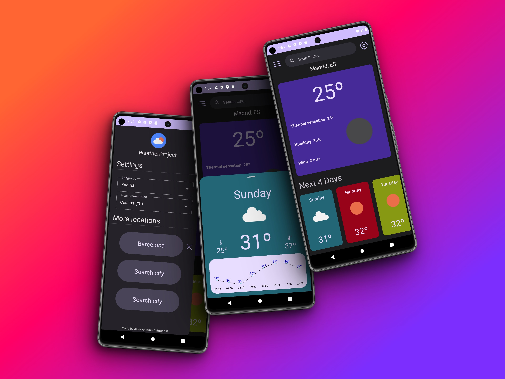

<!-- Mejora de la compatibilidad del enlace "Volver arriba" -->
<a name="readme-top"></a>
[](/README.md)


<!-- LOGO DEL PROYECTO -->
<br />
<div align="center">
  <a href="https://github.com/JuanAntBuit/WeatherProject">
    
  </a>

<h3 align="center">WeatherProject</h3>

  <p align="center">
    WeatherProject es una aplicación Android hecha en Kotlin que recopila datos de la API de OpenWeatherMap y muestra información climática de todo el mundo.
    <br />
    <br />
  </p>
</div>


<!-- TABLA DE CONTENIDOS -->
<details>
  <summary>Tabla de Contenidos</summary>
  <ol>
    <li>
      <a href="#acerca-del-proyecto">Acerca del Proyecto</a>
      <ul>
        <li><a href="#características">Características</a></li>
        <li><a href="#tecnologías-utilizadas">Tecnologías Utilizadas</a></li>
        <li><a href="#imágenes">Imágenes</a></li>
      </ul>
    </li>
    <li>
      <a href="#guia-de-instalación">Guía de Instalación</a>
      <ul>
        <li><a href="#requisitos-previos">Requisitos Previos</a></li>
        <li><a href="#instalación">Instalación</a></li>
      </ul>
    </li>
    <li><a href="#hoja-de-ruta">Hoja de Ruta</a></li>
    <li><a href="#licencia">Licencia</a></li>
    <li><a href="#diseño">Diseño</a></li>
    <li><a href="#contacto">Contacto</a></li>
  </ol>
</details>


<!-- ACERCA DEL PROYECTO -->
## Acerca del Proyecto

### Características

* Datos climáticos en tiempo real
* Pronóstico de los próximos 4 días
* Motor de búsqueda para ubicaciones en todo el mundo
* Cambio del sistema de medición entre Métrico/Celsius, Imperial/Fahrenheit y Estándar/Kelvin.
* Integración de GPS para localizar fácilmente el clima en tu ubicación
* Soporte de idioma inglés y español
* Guarda hasta 3 ubicaciones para acceder fácilmente a su información

<p align="right">(<a href="#readme-top">volver arriba</a>)</p>

### Tecnologías Utilizadas

* **Kotlin**: Lenguaje de programación moderno para el desarrollo en Android, conocido por su sintaxis concisa y expresiva
  
* **Android SDK**: Kit de Desarrollo de Software que proporciona herramientas y APIs para construir aplicaciones Android
  
* **Arquitectura MVVM**: Un patrón de diseño que separa una aplicación en tres partes: Model, View y ViewModel, lo que hace que el código esté más organizado y mantenga una experiencia de usuario fluida. Ayuda a gestionar los datos, la interfaz de usuario y la lógica empresarial de manera efectiva
  
* **Shared Preferences**: Interfaz en Android para almacenar pequeñas cantidades de datos de manera persistente, a menudo utilizado para configuraciones de aplicaciones
  
* **ViewModel**: Componente de arquitectura MVVM que contiene datos relacionados con la interfaz de usuario, sobreviviendo a cambios de configuración y eventos del ciclo de vida
  
* **LiveData**: Componente de arquitectura que permite la observación de datos para componentes de la interfaz de usuario, actualizándose automáticamente cuando cambian los datos subyacentes
  
* **ViewBinding**: Librería que genera clases de enlace para diseños XML, permitiendo la interacción directa con las vistas y mejorando la seguridad en el tipo
  
* **Coroutines**: Librería de Kotlin para administrar tareas asíncronas de manera más concisa y segura, simplificando la programación de múltiples hilos
  
* **Flows**: Flujos de datos asíncronos de Kotlin con soporte para control de flujo y manejo de errores
  
* **Retrofit**: Librería de redes para Android que simplifica las solicitudes y respuestas HTTP, a menudo utilizada para la comunicación con APIs
  
* **MPAndroidChart**: Potente librería para crear varios tipos de gráficos en aplicaciones Android
  
* **Glide**: Biblioteca de carga de imágenes para cargar y almacenar en caché imágenes de manera eficiente en aplicaciones Android
  
* **Algolia Search API Client**: Librería cliente para integrar los servicios de búsqueda de Algolia en aplicaciones Android, permitiendo funcionalidades de búsqueda potentes

* **Firebase Crashlytics**: Una herramienta de notificación de fallos en tiempo real que ayuda a los desarrolladores a rastrear y analizar los fallos de las aplicaciones.

* **Dagger Hilt**: Framework de inyección de dependencias para Android que simplifica la gestión de dependencias y mejora la modularidad, la testabilidad y el mantenimiento del código.

<p align="right">(<a href="#readme-top">volver arriba</a>)</p>

### Imágenes




<!-- EMPEZANDO -->
## Guía de Instalación

### Requisitos Previos

* Android Studio

### Instalación

1. Clone el repositorio
   ```sh
   git clone https://github.com/JuanAntBuit/WeatherProject.git
   ```
   
3. Cree un archivo `local.properties` en la raíz del proyecto si no existe
   
4. Obtenga una clave API gratuita de OpenWeatherMap desde [aquí](https://home.openweathermap.org/users/sign_in)
   
5. Ingrese su clave en el fichero `local.properties`
   ```kt
   OPENWEATHER_KEY=tu_clave_openweather
   ```
   
6. Necesitará crear una cuenta gratuita en [Algolia](https://www.algolia.com/es/). Luego, cree una aplicación
   
7. Genere una clave API de búsqueda, guarde el ID de la aplicación que haya creado y luego cree un índice dentro de esa misma aplicación. Necesitará guardar el nombre del índice para configurar la funcionalidad de búsqueda

8. A continuación, llene el índice con los siguientes [registros](https://drive.google.com/file/d/1ImLwmPhV83evkeQs1zu2iR8N6k7bQ-Je/view?usp=sharing)

9. Ingrese su clave API de Algolia, ID de la aplicación y nombre del índice en `local.properties`   
   ```kt
   ALGOLIA_KEY=tu_clave_algolia
   ALGOLIA_APP_ID=tu_app_id
   ALGOLIA_INDEX_NAME=tu_nombre_indice
   ```

<p align="right">(<a href="#readme-top">volver arriba</a>)</p>


<!-- HOJA DE RUTA -->
## Hoja de Ruta

- Testing

<p align="right">(<a href="#readme-top">volver arriba</a>)</p>


<!-- Diseño -->
## Diseño
El diseño de la pantalla principal está insipirado en el concepto [Weather App Freebie](https://www.uplabs.com/posts/weather-app-freebie) de [Raman Yv](https://www.uplabs.com/ramandesigns9).


<!-- LICENCIA -->
## Licencia

Se distribuye bajo la licencia GPL-3.0. Consulte `LICENSE` para obtener más información.

<p align="right">(<a href="#readme-top">volver arriba</a>)</p>


<!-- CONTACTO -->
## Contacto

Juan Antonio Buitrago B. - juanantoniobuit@gmail.com

Linkedin: [https://www.linkedin.com/in/juan-antonio-buitrago-balsalobre/](https://www.linkedin.com/in/juan-antonio-buitrago-balsalobre/)

Enlace al Proyecto: [https://github.com/JuanAntBuit/WeatherProject](https://github.com/JuanAntBuit/WeatherProject)

<p align="right">(<a href="#readme-top">volver arriba</a>)</p>
